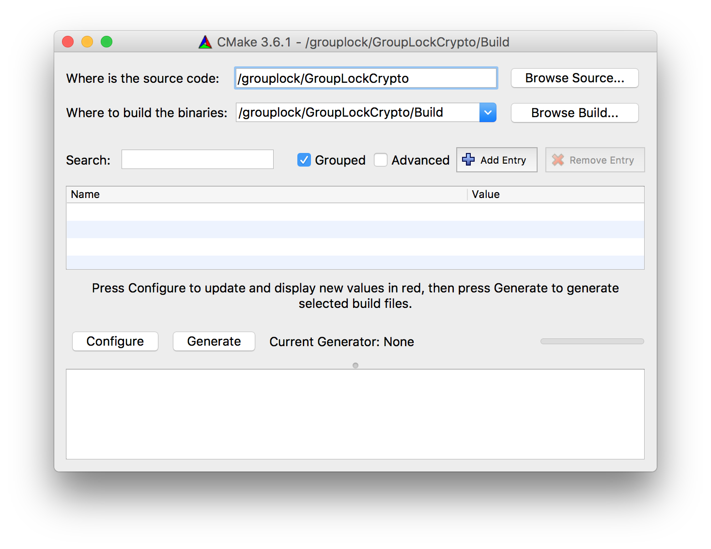
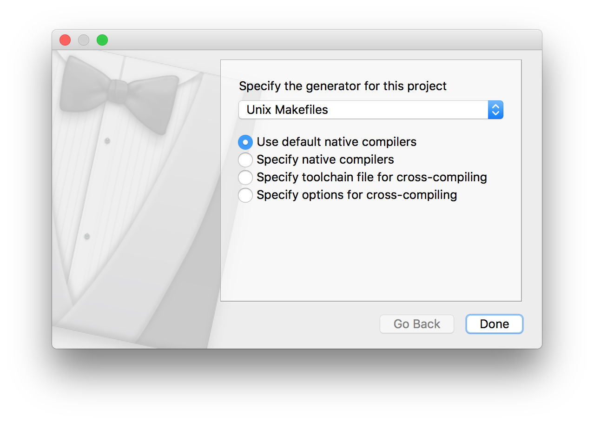

GroupLock
===

|| Status |
| --- |---|
| Travis CI (iOS) |  |
| Code Coverage (iOS) |  |
| Code Quality (Swift) |  |
| Code Quality (Java) |  |

Hey! This is a GroupLock project. This will allow you (in near future) to stay non-stressed about your file you sent to your mum.

Installation
------------

### C++ Crypto Library (libsodium-based)
For building the crypto library we use [CMake](http://cmake.org) as frontend.
> CMake is used to control the software compilation process using simple platform and compiler independent configuration files, and generate native makefiles and workspaces that can be used in the compiler environment of your choice.

So, using CMake not only can you generate Unix Makefiles to build and test the project using `make` and `make test` commands, but also generate fully functional MS Visual Studio projects or Apple Xcode projects, so you can keep developing using an IDE you like.

All the configuration settings are in the `CMakeLists.txt` file.

First of all, you need to install CMake. Download it for your platform from [here](http://cmake.org/download/) and install. As soon as you did, follow these steps:
#### If you like GUI
1. Open CMake app.
1. In the first line (for source code) paste a path to wherever a top-level `CMakeLists.txt` file is located, namely `GroupLockCrypto` directory.
1. In the second line (for binaries) paste a path to the `Build` directory.

1. Click **Configure**. Choose what you want CMake to generate: Visual Studio project, Makefile or something else.

1. When configuration succeeds, click **Generate**. After that something appears in the `Build` directory depending on what you've chosen to generate.

#### If you like command line (and conciseness)
1. Make sure CMake command line tools are installed and install them if they're not (**Tools** → **How To Install For Command Line Use**)
1. Navigate to the `Build` directory (namely `GroupLockCrypto/Build`)
1. Execute the `cmake ..` (note the points!) command if you want to generate the default solution — Makefile. Otherwise execute `cmake .. -G <generator name>`. Substitute `<generator name>` for `"Visual Studio 15"` or `Xcode` or whatever you want.

When it's done and all the necessary files are generated, you can work on the project in a way you like. Just make sure that source files never escape the `Source` directory, because in the current configuration CMake looks for all the \*.h and \*.cpp files located inside it.

**Important note:** Don't commit anything generated by CMake. Just don't. After you've generated your favorite IDE project, you can add, delete and modify any source files (again, just as long as they're inside `Source/`), commit, push and pull those changes. If something changes in the `CMakeLists.txt` file, CMake automatically reconfigures and regenerates as soon as you hit **Build**, so no point in keeping build files in the repo.

### Android
1. Download [Java Development Kit](http://www.oracle.com/technetwork/java/javase/downloads/jdk8-downloads-2133151.html).
1. Download [Android Studio](https://developer.android.com/sdk/index.html)
1. Sign up for [genymotion.com](https://www.genymotion.com/account/create/) and download [Genymotion](https://www.genymotion.com/pricing-and-licensing/) with VirtualBox
1. Install JDK
1. Install Android Studio
1. Install VirtualBox and Genymotion. After installation run Genymotion and add virtual device.

Run Android Studio.

1. Go to **File → Open**, choose **GroupLockApplication** and press **OK**
1. Go to **Preferences → Plugins** and click **Browse Repositories**, then look for **Genymotion**. Right click and choose **Download and Install**.
1. Restart Android Studio. You should see a new icon (**Genymotion Device Manager**) in your IDE.
1. Open **Genymotion Device Manager** and start your virtual device.
1. In Android Studio, press the **Play** or **Debug** button, and you should see the dialog that asks you to choose an emulator. One of them will be the Genymotion emulator. After you choose that emulator and press **OK**, it will run the application in the Genymotion emulator.

### iOS

For building an app on iOS you need a Mac with Xcode intalled on it. You can get Xcode from Mac App Store.

1. Make sure you have the latest version of [CocoaPods](https://cocoapods.org) intalled. In order to install CocoaPods open **Terminal** and execute the following command: ` $ sudo gem install cocoapods`
1. Clone the repository and go to `GroupLockiOS` directory in Terminal.
1. Execute `$ pod install`. All the needed dependencies will be installed.
1. The project is ready to work with.

**Important:** use `GroupLock.xcworkspace` file, not `GroupLock.xcodeproj`!
